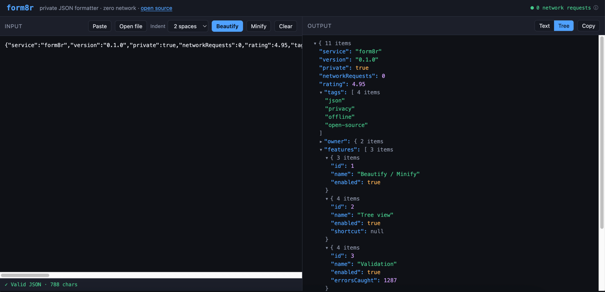

# form8r

**A genuinely private JSON formatter & validator. Runs entirely in your browser. Zero network. Zero dependencies. Zero build step.**

[form8r.com](https://form8r.com) · [source on GitHub](https://github.com/OleksiiHolyk/form8r)

   



Most online JSON tools say "your data never leaves your browser." form8r is built so you can *verify* it: open DevTools → Network and you'll see exactly zero requests after the page loads. No analytics, no trackers, no external CDNs or fonts, no npm dependencies, and a strict Content-Security-Policy that forbids the browser from making any outbound connection at all.

There is no build pipeline. The files in this repo *are* the files that run in your browser — what you read here is exactly what executes. Nothing is transpiled, bundled, or minified.

## Features

- **Beautify / Minify** with configurable indent (2, 4, or tab)
- **Validation** with human-readable errors that jump to and highlight the exact spot
- **Line numbers** with the error line marked
- **Tree view** with collapsible nodes, collapsed previews, and collapse / expand all
- **Paste from clipboard** or drop a `.json` file straight into the input box
- **Large files** parsed in a Web Worker so the UI never freezes
- **Offline** — installable PWA; works with no network after first load
- **`Ctrl`/`Cmd`+`Enter`** to format

## How privacy is guaranteed (not just promised)

1. **No external requests, by architecture.** Every file is plain, self-hosted, vanilla JS/CSS. No Google Fonts, no CDN scripts, no analytics SDKs.
2. **No dependencies, no build.** Nothing from npm runs in your browser or on a build server, so there is no supply-chain surface to poison. (See [no build step](#why-no-build-step).)
3. **Strict CSP via HTTP headers** (`_headers`): `connect-src 'self'` plus `default-src 'self'` means the browser itself blocks any attempt to send data anywhere.
4. **Live network indicator.** The header shows a running count of network calls made by the page (`fetch`, `XHR`, `sendBeacon`). It should always read `0` — click it to learn more.
5. **Reproducible by inspection.** Read the source, compare it to what's served — they're identical.

## Run locally

No toolchain needed. The deployed site lives in `public/`. Just serve that folder over HTTP (ES modules and the service worker don't work from `file://`):

```bash
cd public
python3 -m http.server 8080
# then open http://localhost:8080
```

Any static server works (`npx serve`, `php -S`, etc.). There is no `npm install`.

## Tests

The JSON logic is covered by unit tests using Node's built-in test runner — still zero dependencies:

```bash
node --test     # or: npm test
```

CI runs the suite on every push and pull request (`.github/workflows/ci.yml`).

## Project layout

The deployed site is everything in `public/`; the repo root holds tooling and docs.

```
public/                 ← the entire deployed site
  index.html            app shell
  style.css             styles
  app.js                UI wiring + network watchdog + SW registration
  json.js               parse / beautify / minify / error reporting
  tree.js               collapsible tree view
  worker.js             off-main-thread formatting for large files
  sw.js                 hand-written service worker (offline cache, ~40 lines)
  manifest.webmanifest  PWA manifest
  _headers              strict CSP + security headers (Cloudflare / Netlify)
  robots.txt, sitemap.xml, og-image.png, icons
test/                   unit tests (node:test, no dependencies)
.github/                CI workflows + CODEOWNERS
```

> Deploying on Cloudflare Pages: set **Build output directory** to `public`.

## Why no build step

The product's whole promise is trust. A build step (bundler + transpiler + their dependencies) is exactly the place a supply-chain attack injects code into what users receive. By shipping plain ES modules with no dependencies, that entire risk class disappears, and the deployed site is byte-for-byte auditable against this repo.

## License

MIT
